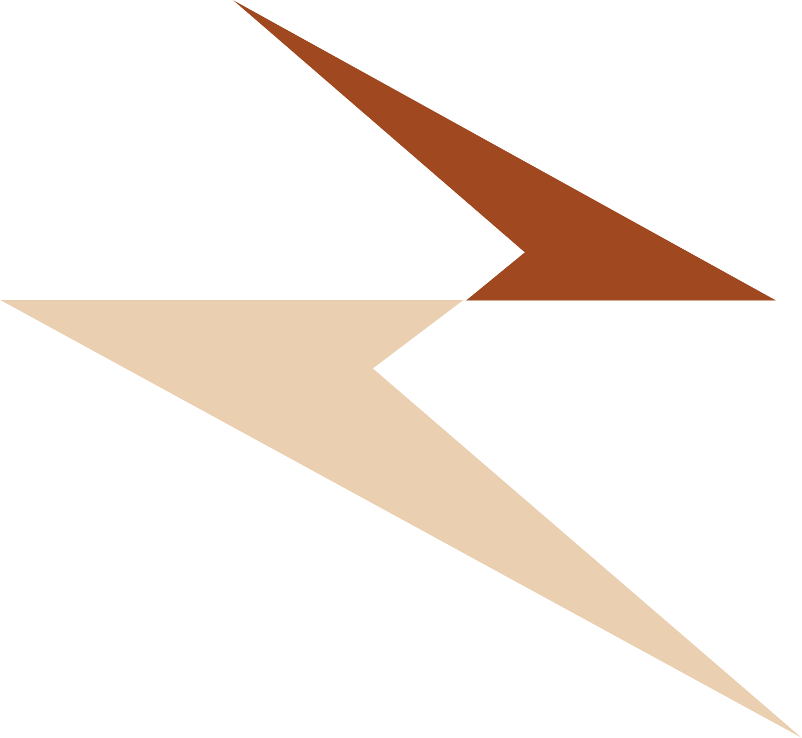

<h1 align="center">こんにちは、ケビン・シモランキルです.🙌</h1>

  
  
  
  
  

<h3 align="justify">I am currently a student majoring in Informatics Engineering. With various relevant experiences according to my interests, I have expertise in creating websites in communities and organizations. I also have expertise in creating UI and UX designs visually for desktop and mobile. And currently involved in the world of UI and UX design. 
</h3>

##  **Languanges and Tools**

  
  
  
  
  
  
  
  
  
  
  
  
  
  
  
  
  
  
  

<h3 align="left">Github Stats</h3>

